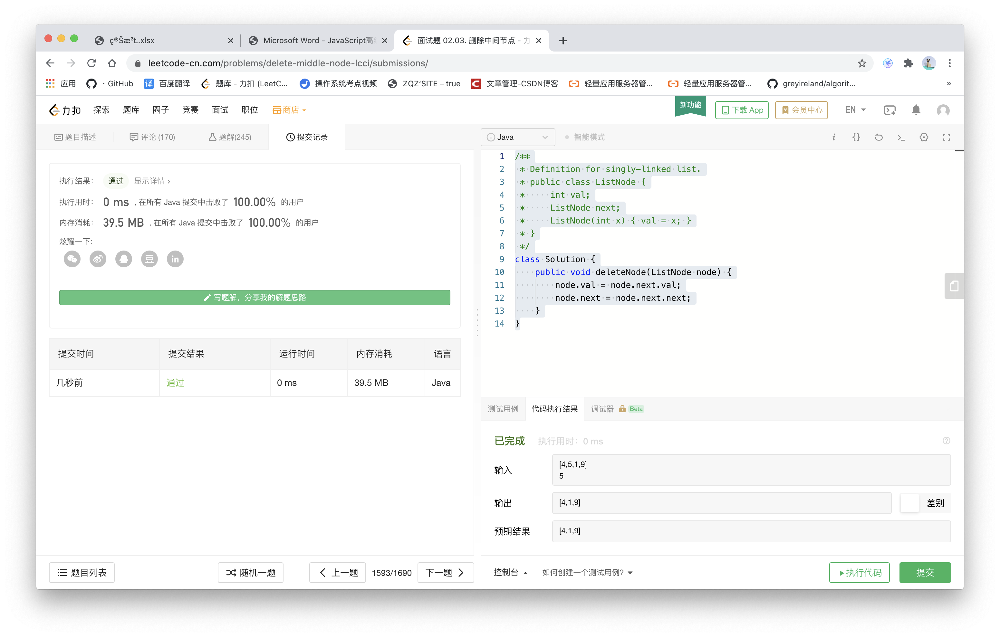

## Discription

---

Implement an algorithm to delete a node in the middle (i.e., any node but the first and last node, not necessarily the exact middle) of a singly linked list, given only access to that node.

## Examples

---

Example **1**:

> Input:
>
> the node c from the linked list a->b->c->d->e->f

> Output: 
>
> nothing is returned, but the new linked list looks like a->b->d->e->f

## Think

---

只能访问当前节点，所以不能直接赋值赋址

将下一个节点的值赋给该节点,该节点的next指向下下个节点,实际是删除了下一个节点

## Solution

```js
/**
 * Definition for singly-linked list.
 * public class ListNode {
 *     int val;
 *     ListNode next;
 *     ListNode(int x) { val = x; }
 * }
 */
class Solution {
    public void deleteNode(ListNode node) {
        node.val = node.next.val;
        node.next = node.next.next;
    }
}
```



[来源：力扣（LeetCode）著作权归领扣网络所有。商业转载请联系官方授权，非商业转载请注明出处。](https://leetcode-cn.com/problems/merge-sorted-array)

