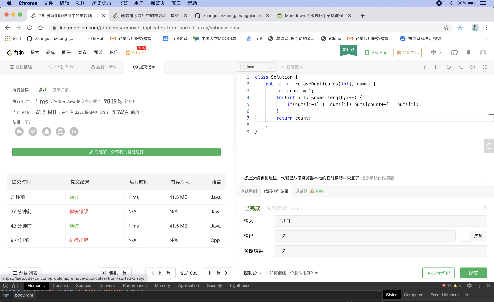

## Discription

---

Given a sorted array nums, remove the duplicates in-place such that each element appear only once and return the new length.

Do not allocate extra space for another array, you must do this by modifying the input array in-place with O(1) extra memory.

## Examples

**Example 1:**

> Given nums = [1,1,2],

Your function should return length = _2_, with the first two elements of nums being 1 and 2 respectively.

It doesn't matter what you leave beyond the returned length.
**Example 2:**

> Given nums = [0,0,1,1,1,2,2,3,3,4],

Your function should return length = _5_, with the first five elements of nums being modified to 0, 1, 2, 3, and 4 respectively.

It doesn't matter what values are set beyond the returned length.

**Clarification:**

Confused why the returned value is an integer but your answer is an array?

Note that the input array is passed in by reference, which means modification to the input array will be known to the caller as well.

Internally you can think of this:

```java
// nums is passed in by reference. (i.e., without making a copy)
int len = removeDuplicates(nums);

// any modification to nums in your function would be known by the caller.
// using the length returned by your function, it prints the first len elements.
for (int i = 0; i < len; i++) {
    print(nums[i]);
}
```


## Think

---

We can place two pointers, i and j, where I is a slow pointer and j is a fast pointer. As long as  nums[i] = nums[j], we add J to skip the duplicates.
When we encounter nums[j]!=nums[i]  , the skip duplicates run is over, so we have to copy its (nums [J]) value to nums [i + 1]. Then increment I, and we'll repeat the same process again until J reaches the end of the array.

## Solution

---



[来源：力扣（LeetCode）著作权归领扣网络所有。商业转载请联系官方授权，非商业转载请注明出处。](https://leetcode-cn.com/problems/remove-duplicates-from-sorted-array)

