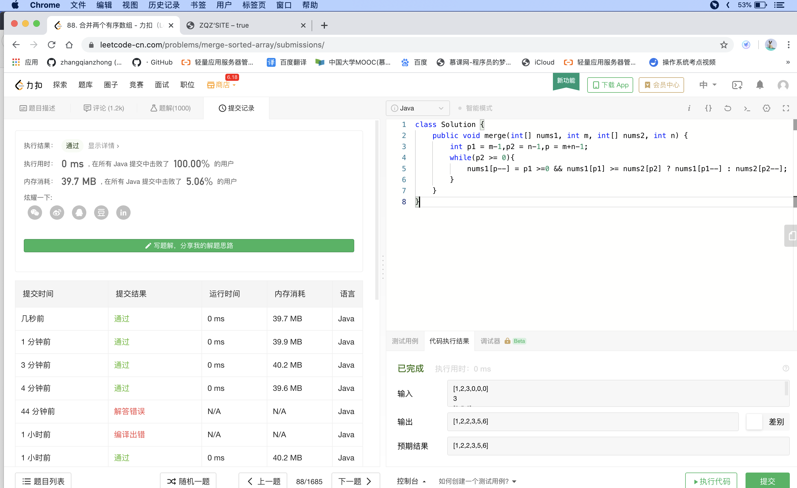

## Discription

---

Given two sorted integer arrays nums1 and nums2, merge nums2 into nums1 as one sorted array.

##### Note:

The number of elements initialized in nums1 and nums2 are m and n respectively.
You may assume that nums1 has enough space (size that is greater or equal to m + n) to hold additional elements from nums2.

## Think

---

Traverse the two arrays backwards to get the maximum value and put it at the end of nums1,
If nums2 traverses, the remaining data of num1 that is not traversed will remain the same, so you can exit the loop,
After nums1 traversal, put the remaining data of num2 into nums1 in turn

## Solution

---

```java
class Solution {
    public void merge(int[] nums1, int m, int[] nums2, int n) {
        int p1 = m-1,p2 = n-1,p = m+n-1;
        while(p2 >= 0){
            nums1[p--] = p1 >=0 && nums1[p1] >= nums2[p2] ? nums1[p1--] : nums2[p2--];
        }
    }
}
```



[来源：力扣（LeetCode）著作权归领扣网络所有。商业转载请联系官方授权，非商业转载请注明出处。](https://leetcode-cn.com/problems/merge-sorted-array)
