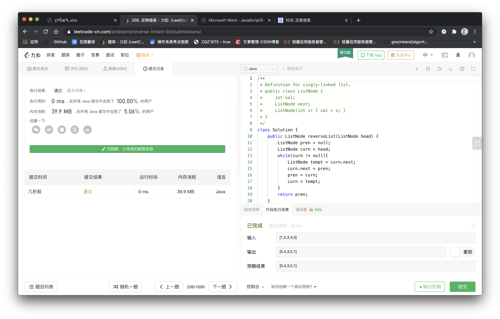

## Discription

---

Reverse a singly linked list.

## Examples

---

Example **1**:

> Input:
>
> 1->2->3->4->5->NULL

> Output: 
>
> 5->4->3->2->1->NULL

## Think

---

设置三个指针，指针1指向前一个节点，指针二指向后一个节点，最后一个指针用于存储第二个节点.next，首先将指针三保存，再将指针二指向指针一，最后指针一、二向后移一个节点，直到第二个节点为null。

##Solution

```js
/**
 * Definition for singly-linked list.
 * public class ListNode {
 *     int val;
 *     ListNode next;
 *     ListNode(int x) { val = x; }
 * }
 */
class Solution {
    public ListNode reverseList(ListNode head) {
        ListNode pren = null;
        ListNode curn = head;
        while(curn != null){
            ListNode tempt = curn.next;
            curn.next = pren;
            pren = curn;
            curn = tempt;
        }
        return pren;
    }
}
```



[来源：力扣（LeetCode）著作权归领扣网络所有。商业转载请联系官方授权，非商业转载请注明出处。](https://leetcode-cn.com/problems/merge-sorted-array)